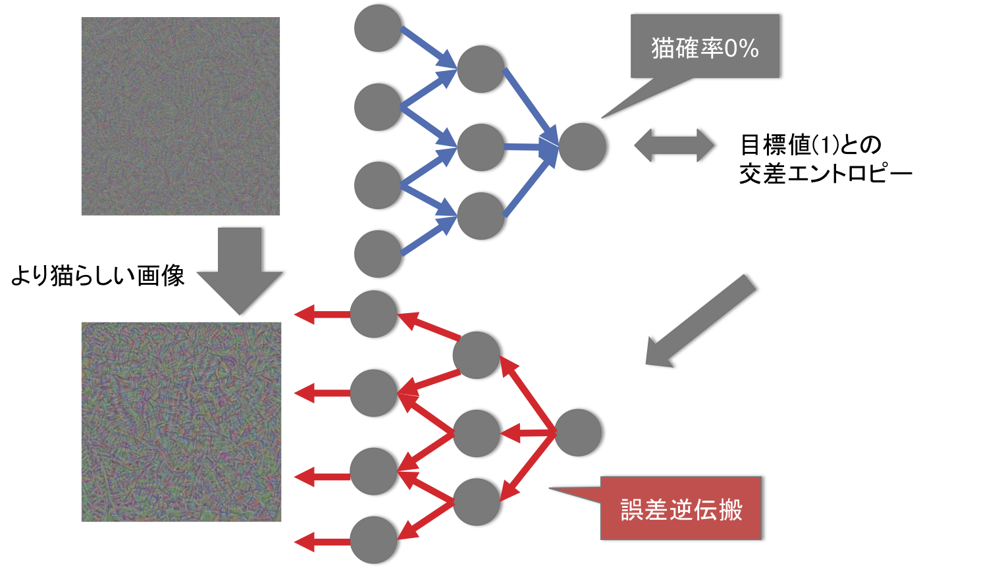
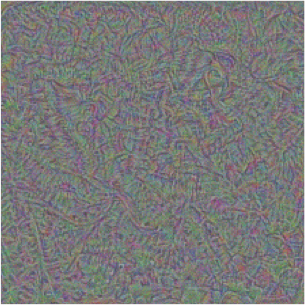

========================================
ディープバストアップ
========================================

:執筆: @Hi_king

概要
================

この章では、巨乳化という、全貧乳キャラの悲願を、近年はやりの深層学習を用いて達成するための試行錯誤を解説する。
つまり、ディープな学習でディープなバストを手に入れよう、というものである。
2015年には、他の画像の画風を転写する手法や、イラストを入力することで巨乳度を計算できる手法などが提案された。
本項ではこれらの論文にアイデアを得て巨乳度の転写を目指す。

誤差逆伝搬による画像生成
=================================

.. _f1:

  誤差逆伝搬による、識別器に目標出力を出させる入力画像生成

.. _f2:

  識別器によって猫と判定される画像

物体識別のためにトレーニングされたネットワークから画像を生成するという手法は、
ネットワークの可視化手法として提案されてきた [r1]_。
物体認識を行うようにトレーニングされたネットワークでは、入力画像から、その画像のある特定のクラスへの所属確率を出力することができる。
ここでは、任意の画像を元にして、その画像を、任意のクラスに所属させられるように変化させることを考える。

ランダムノイズを元画像とした、誤差逆伝搬による画像生成の概要を :ref:`f1` に示す。
元画像のランダムノイズを :math:`X_0` とし、:math:`X_0` からネットワークの準伝播によって得られたクラス所属確率を :math:`P_0` とする。:math:`P_0` はその識別器が出力可能な全クラスへの所属確率のベクトルである。
この画像を変化させて、達成したい所属クラスを定め、そのクラスを1、他のクラスを0年経ベクトルを :math:`P_t` とする(たとえば猫の次元のみが1で他の次元が0の1000次元ベクトル)。 :math:`P_0` と :math:`P_t` の交差エントロピーを求め、最終層での誤差とすると、このネットワークで誤差逆伝搬を行うことで、入力層でのピクセル単位での誤差を計算することができる。
これを利用して、たとえば確率的勾配降下法で、より :math:`P_t` に近い :math:`P_1` を出力するように次の入力 :math:`X_1` を生成することができる。
この操作を繰り返すことで、十分 :math:`P_t` に近い出力を得られる :math:`X` が生成できるというものである。

テクスチャ生成
======================

任意のタグの画像生成
======================

画像のモーフィング
======================

参考文献
======================

* .. [r1] Nguyen A, Yosinski J, Clune J.
          `Deep Neural Networks are Easily Fooled: High Confidence Predictions for Unrecognizable Images. <http://www.evolvingai.org/fooling>`_
          In Computer Vision and Pattern Recognition (CVPR '15), IEEE, 2015.
