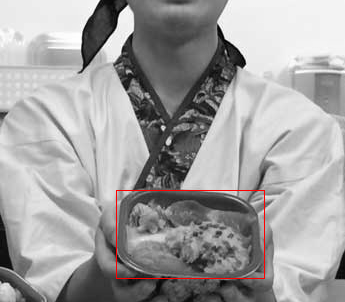

=====
丼丸認識API
=====

:執筆: @brly

概要
====
本稿は, 丼丸を含む画像を ``HTTP POST`` した際に丼丸を含む矩形とその丼丸が何丼であるかの情報を
返すWebAPIを作成することを目的として, 試行錯誤した記録である.
なお, 丼丸が一体何であるかについては [#f1]_ を参照されたい.

全体の処理の流れ
=====

以下に示すようなAPIの実装を本稿では目的として行った.

1. クエリ画像が与えられたら一定以下にリサイズする
2. リサイズ後のクエリ画像について dlib [#f3]_ を用いて評価すべき部分画像を列挙する

  * 各部分画像についてのベクトル表現を得る
  * 1クラスSVMを用いて部分画像が丼丸かどうか判定する
  * 判定の結果が丼丸であるならばマルチクラスSVMを用いてどの丼丸か判定する

3. 丼丸である確率が高い部分画像の矩形情報と, その部分画像が含む丼丸がどの丼丸であるかを返す

部分画像の列挙
=====
概要で述べたような目的をWebAPIの形で達成するためには, まず評価する必要のある部分画像を高速に選定できる必要がある.

実は本稿のネタ探しに詰まっていたところ, 機械学習界隈で著名な方のblog記事 [#f5]_ にたどり着き
Selective Search なる部分画像を提案してくれるアルゴリズムが存在することが分かり, 本稿のテーマを決定した.
記事を書かれた @kivantium 氏には大変感謝している.

本稿ではこの Selective Search を用いて実際に評価する部分画像の列挙を行っている.
記事 [#f5]_ にもあるように, Selective Search を実装している dlib [#f3]_ というライブラリがあり, それを利用した.

筆者が試した時期(2015年/12月, バージョン18.18) において dlib [#f3]_ はバイナリ配布されておらず, ソースからビルドする必要があった.
筆者の環境 MacOSX(10.10.5) では ``/opt/X11/include`` をインクルードパスに追加することでビルドに成功した.

dlib 内で実際に利用した関数は blog記事 [#f5]_ でも言及されている ``dlib::find_candidate_object_locations`` を利用した.
該当関数は ``dlib/image_transforms/segment_image.h`` にあり, シグネチャは以下のようになっている.

::

  template <
        typename in_image_type,
        typename EXP
        >
    void find_candidate_object_locations (
        const in_image_type& in_img_,
        std::vector<rectangle>& rects,
        const matrix_exp<EXP>& kvals,
        const unsigned long min_size = 20,
        const unsigned long max_merging_iterations = 50
    )

::

C++ では見つからなかったが python ではこの関数を使うためのサンプルコード
(find_candidate_object_locations.py)が存在し, 当該の関数については

::

    dlib.find_candidate_object_locations(img, rects, min_size=500)

::

このように使われている. C++版 ではデフォルト引数は最後の2つのみで明示的に3番目の引数である ``kvals`` を与える必要がある.
とりあえず動かしてみようにも, 一体どんなパラメータなのかわからず途方に暮れていた所,
``dlib/image_transforms/egment_image_abstract.h`` というヘッダがあり,
どうやら当該の関数を含む, ``segment_image.h`` 内のソースの説明が書かれていた.
また, ``kvals`` についてもデフォルト引数が設定されており

::

  template <
        typename in_image_type,
        typename EXP
        >
    void find_candidate_object_locations (
        const in_image_type& in_img,
        std::vector<rectangle>& rects,
        const matrix_exp<EXP>& kvals = linspace(50, 200, 3),
        const unsigned long min_size = 20,
        const unsigned long max_merging_iterations = 50
    );

::

となっていた. ``kvals`` についてのコメントを見ると, 関数内部においてセグメンテーションは ``kvals.size()`` 回
行われ, それぞれのセグメンテーションにおいてパラメータ ``k`` の値が用いられる(詳細については segment_image 関数と Felzenszwalb の論文を参照),
と記述されている.

なので同じヘッダ内にある ``segment_image()`` のコメントを見てみると

::

  パラメータ k は分割領域がどのような大きさになるかについて影響を与えるものです.
  一般的に k が大きいほど大きな分割が生成されます. 深い考察については論文を参照.

::

とのことだった. パラメータkの意義はざっくり分かったが, ``find_candidate_object_locations``
では複数個のパラメータkを与えることが出来る. 再び当該関数のソースを読んでみると, これは複数回の探索結果の矩形情報を
マージするということだった.
そのため, デフォルトでは ``linspace(50, 200, 3)`` のように異なる k の値を複数与えているということが分かった.

しかし, なぜこのような値の与え方にしているのかは論文を読まねば分からなそうである.
こちらについては誠に申し訳ないが, 時間の都合上省略させて頂く.

さて ``dlib::find_candidate_object_locations`` の残りの引数について,
``in_img, rects`` は説明不要として, ``min_size, max_merging_iterations`` はそれぞれ

* min_size : 基本的な分割を行う際に, ``min_size`` 分の pixel を含まない矩形は途中で捨てられるようになる.
* max_merging_iterations : 矩形のマージを試すイテレーションの最大回数であり, この値が大きくなるほど沢山の矩形が出力として得られるようになる.

ということであり, これらのパラメータは部分画像列挙に関する高速化と精度高上のトレードオフを
調整することが可能なパラメータであることが分かる.

部分画像の評価
=====
dlib [#f3]_ を用いて評価すべき部分画像が得られたら, 次にそれが丼丸であるか判別できる必要がある.
そこで libsvm [#f2]_ による1クラスSVMを用いて与えられた部分画像が丼丸であるか識別することにする.
ここでは予め学習を行って識別のためのモデルを用意しておき, 各部分画像を特徴ベクトル化し識別機にかけて判定する.
全体の処理の流れでも述べたように, 丼丸である確率が高い部分画像についてはさらにマルチクラスSVMを用いて何の丼であるかの判定を行う.

モデルの生成, ベクトルの識別は libsvm [#f2]_ に同梱されている ``svm-train`` ``svm-predict`` を使用した.

また画像を表現する特徴ベクトルは Dense Sampling Sift を用いて 8192次元のベクトルとした.

学習
=====
先に述べたように, 部分画像の評価には予めSVMの学習が必要になる.
また1クラスSVMの学習の際には ``Data-Driven-Uniqueness`` [#f4]_ を計算するアプローチを参考にした.

この手法は, 類似画像検索などを行う際に ``query-dependent weight vector`` と呼ばれるベクトル値をクエリ画像ごとに計算し,
このベクトル値と比較対象となる画像の特徴ベクトルとの内積を類似度に用いることでよい結果が得られると述べている.

また, この特殊なベクトルの計算方法として,
クエリ画像とその左右反転画像などを加えた少数の画像をポジティブサンプル, そして無作為に選択したおよそ1万枚の画像を
ネガティブサンプルとしてそれぞれ特徴ベクトルを求めて, libsvm [#f2]_ を用いた線形SVMによる学習を行った際に
得られたサポートベクトルを ``query-dependent weight vector`` としている.

この手法は, クエリ画像が与えられる度に大量のサンプルを用いた線形SVMによる学習が必要になるため,
計算コストが大きすぎることが課題として論文内でも述べられているが, 本稿のようなケースにおいては
検索クエリ画像は丼丸のみとなるため, 事前に学習を行っておけばAPIが呼ばれる度に学習を行う必要はない.

実際に利用したポジティブサンプル用の画像は公式サイト [#f1]_ のものを利用した.
またネガティブサンプル用のデータセットはこちら [#f4]_ で配布されているものを利用した.

WebAPIに向けての高速化
=====
TBD

結果
=====
TBD

参考文献
====

.. [#f1] http://sasafune.co.jp/
.. [#f2] https://www.csie.ntu.edu.tw/~cjlin/libsvm/
.. [#f3] http://dlib.net/
.. [#f4] http://graphics.cs.cmu.edu/projects/crossDomainMatching/
.. [#f5] http://kivantium.hateblo.jp/entry/2015/07/25/184346
