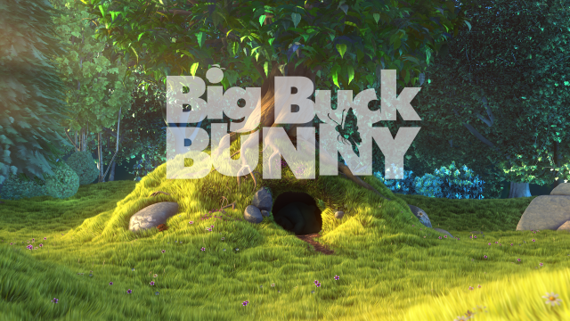
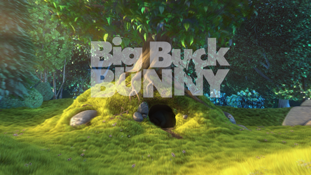

========================================
フレーム補完
========================================

:執筆: @Hi_king

概要
================

この章では、"このシーンもう少しヌルヌル動いて欲しいんだよなぁ"という要望を、ニューラルネットを利用して満たそうというものである。"もっと高解像度の萌え絵が欲しいんじゃぁ"という要望を満たす手法が存在するので [r1]_ [r2]_ それを参考に、時間方向に拡張することで当手法とする。

CNNで超解像
================

既存研究 [r1]_ [r2]_ で提案されている、解像度を上げるためのニューラルネットについて概要を述べる。

CNNでフレーム補完
==================

Convolutional LSTM
===================

フレーム補完は時間方向の学習であり、前節で述べた手法は時間の特性を無視したものになっている。例えば、フレーム間での動きの激しさというのはシーンによって異なるため、前節のように前後Nフレームを固定して扱う手法では不足な部分がある。時間方向の伸縮を扱う仕組みとして、再帰構造を持つネットワーク(RNN, LSTM)が提案されている[要出典]。入力として画像を用いるものとしてConvolutional LSTM [r3]_ が提案されている。ここではその概要を説明する。

実験
===============

以下で用いるデータは全てBlenderの"Big Buck BUNNY" [r4]_ のシーンから利用する。
本来、作画枚数の少ないセルアニメの方が良いのだが、よいサンプル動画を手に入れることが出来なかった。
元のデータが十分ヌルヌルすぎるので、8フレームずつダウンサンプリングして利用した。

学習
----------------

200フレームを利用

予測
----------------

.. |naive| image:: ./imgs/result/naive_0148.png

+-------------+---------------+
| input1      | input2        |
| |original1| | |original2|   |
+-------------+---------------+
| naive       | output        |
| |output|    | |naive|       |
+-------------+---------------+

参考文献
================

 * .. [r1] "Image Super-Resolution Using Deep Convolutional Networks"
 * .. [r2] "waifu2x", http://waifu2x.udp.jp/
 * .. [r3] "Convolutional LSTM Network: A Machine Learning Approach for Precipitation Nowcasting"
 * .. [r4] "Big Buck BUNNY", https://peach.blender.org/download/

